# YouTube Data Lakehouse and Analysis

A Streamlit application that harvests channel, playlist, video, and comment data for any public YouTube channel via the **YouTube Data API v3**, lands it in **MongoDB** as a schema-flexible data lake, transforms and migrates it into a **MySQL** data warehouse, and exposes a set of curated SQL analyses for interactive exploratory data analysis (EDA) — all from a single-page web UI.

> **Author:** Vivek S
> **License:** MIT

---

## Overview

The project follows a lightweight **Extract → Load → Transform → Analyze** (lakehouse) pattern:

```
 ┌─────────────────┐      ┌──────────────┐      ┌───────────────┐      ┌──────────────────┐
 │  YouTube Data    │      │   MongoDB    │      │     MySQL     │      │    Streamlit      │
 │  API v3          │ ───► │  (Data Lake) │ ───► │ (Data Warehouse)│ ──► │  EDA & Dashboard   │
 │  Extract         │      │  Load        │      │  Transform      │    │  Analyze           │
 └─────────────────┘      └──────────────┘      └───────────────┘      └──────────────────┘
```

1. **Extract** — Given a Channel ID, the app calls the YouTube Data API to pull channel metadata, playlists, all uploaded videos (with statistics and duration), and top-level comments.
2. **Load** — The raw, nested response is written to MongoDB as a single document per channel, preserving the original hierarchical structure.
3. **Transform** — Data is cleaned, type-cast, and flattened, then migrated from MongoDB into normalized MySQL tables (`channel`, `playlist`, `video`, `comment`).
4. **Analyze** — Ten predefined SQL queries surface channel and video-level insights, rendered as tables and bar charts directly in the app.

---

## Features

- 🔑 **Bring your own API key** — no credentials are baked into the app; the YouTube API key is supplied at runtime via the sidebar.
- 📥 **Full-channel extraction** — channel profile, all playlists, every uploaded video (with parsed ISO-8601 durations), and top-level comment threads, with automatic pagination.
- 🌊 **Data lake storage** — each channel is stored as one MongoDB document, keeping raw structure intact for flexible reuse.
- 🏗️ **Warehouse migration** — a one-click migration transforms and loads all (or newly added) MongoDB channel documents into a normalized MySQL schema.
- 📊 **Ten built-in analyses**, e.g. top 10 most-viewed videos, channels ranked by upload count, average video duration per channel, most-commented videos, and more — each rendered as a table and, where relevant, a bar chart.
- 🔒 **Secrets kept out of source** — database credentials are read from `st.secrets` / `.streamlit/secrets.toml`, which is git-ignored.

---

## Tech Stack

| Layer | Technology |
|---|---|
| UI / App framework | [Streamlit](https://streamlit.io/) |
| Data extraction | [google-api-python-client](https://github.com/googleapis/google-api-python-client) (YouTube Data API v3) |
| Data lake | [MongoDB](https://www.mongodb.com/) (via `pymongo`) |
| Data warehouse | [MySQL](https://www.mysql.com/) (via `mysql-connector-python`) |
| Data wrangling | [pandas](https://pandas.pydata.org/) |

---

## Project Structure

```
Youtube_API/
├── app.py                          # Main Streamlit application
├── schema.sql                       # MySQL warehouse DDL (channel, playlist, video, comment)
├── requirements.txt                 # Python dependencies
├── .streamlit/
│   └── secrets.toml.example         # Template for required secrets (copy to secrets.toml)
├── README.md
└── LICENSE
```

---

## Prerequisites

- Python 3.9+
- A [YouTube Data API v3 key](https://console.cloud.google.com/apis/library/youtube.googleapis.com) (Google Cloud Console)
- A MongoDB instance (local or [Atlas](https://www.mongodb.com/atlas))
- A MySQL server. The warehouse schema — `channel`, `playlist`, `video`, `comment` (with primary/foreign keys and indexes on the columns the analyses sort by) — is defined in [`schema.sql`](schema.sql) and created in the Setup step below.

---

## Setup

1. **Clone the repository**
   ```bash
   git clone https://github.com/VivekS-DS/YouTube_Data_Lakehouse_and_Analysis.git
   cd YouTube_Data_Lakehouse_and_Analysis
   ```

2. **Create a virtual environment and install dependencies**
   ```bash
   python -m venv .venv
   source .venv/bin/activate      # Windows: .venv\Scripts\activate
   pip install -r requirements.txt
   ```

3. **Create the MySQL warehouse schema**
   ```bash
   mysql -u root -p < schema.sql
   ```
   This creates the `youtube` database along with the `channel`, `playlist`, `video`, and `comment` tables.

4. **Configure secrets**

   Copy the example file and fill in your own values — this file is git-ignored and must never be committed:
   ```bash
   cp .streamlit/secrets.toml.example .streamlit/secrets.toml
   ```
   ```toml
   MONGODB_URI = "mongodb+srv://<user>:<password>@<cluster-host>/?retryWrites=true&w=majority"

   MYSQL_USER = "root"
   MYSQL_PASSWORD = "<password>"
   MYSQL_HOST = "localhost"
   MYSQL_DATABASE = "youtube"
   ```

5. **Run the app**
   ```bash
   streamlit run app.py
   ```

---

## Usage

1. Open the app and, in the sidebar, enter your **YouTube API key** and the **Channel ID** you want to analyze, then click **Submit**. The channel's data is extracted and loaded into MongoDB.
2. Click **Migrate** to transform and load the MongoDB collection(s) into the MySQL warehouse.
3. Use the **Select option** dropdown to run any of the ten predefined analyses and view the results as a table or chart.

### Available analyses

1. All video titles and their channels
2. Channels ranked by number of videos uploaded
3. Top 10 most-viewed videos
4. Comment count per video
5. Videos with the highest likes per channel
6. Top 10 videos by likes
7. Total views per channel
8. Channels that published videos in 2022
9. Average video duration per channel
10. Top 10 most-commented videos

---

## Screenshots

| | |
|---|---|
| **App home**<br>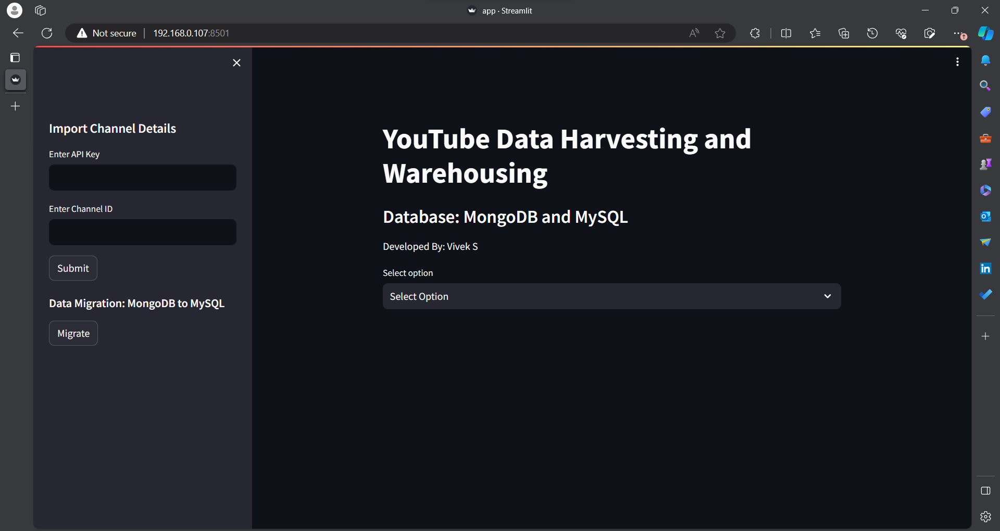 | **1. Video titles & channels**<br>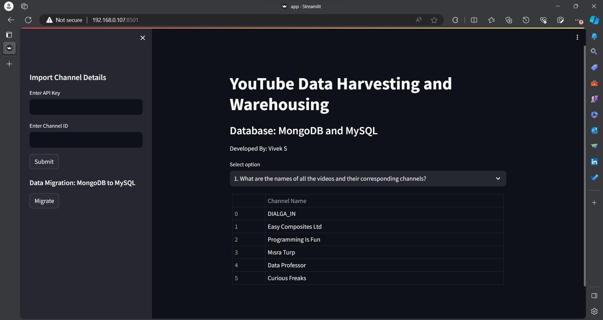 |
| **2. Channels by video count**<br>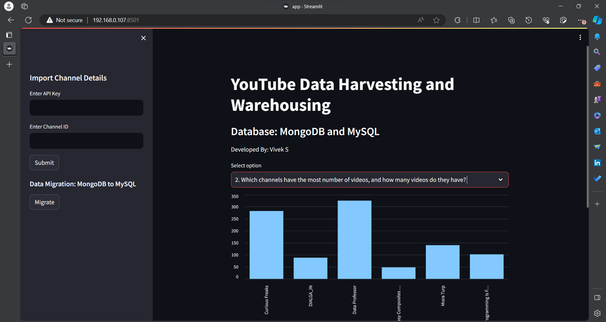 | **3. Top 10 most-viewed videos**<br>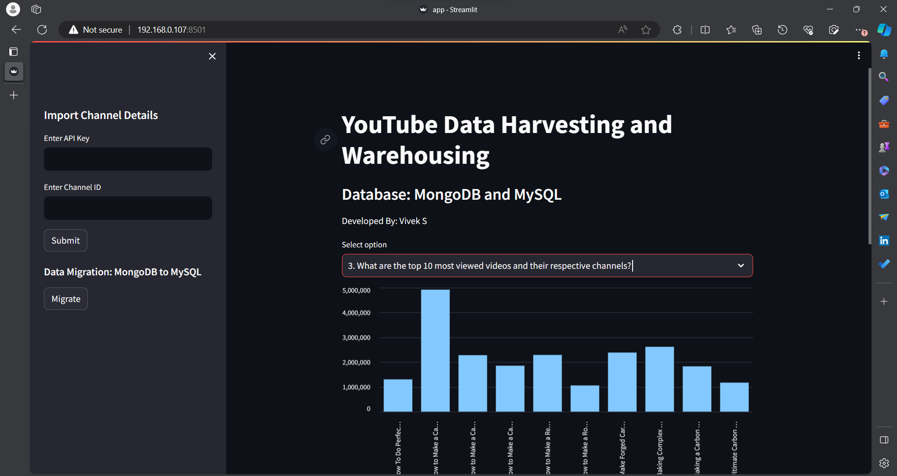 |
| **4. Comment count per video**<br>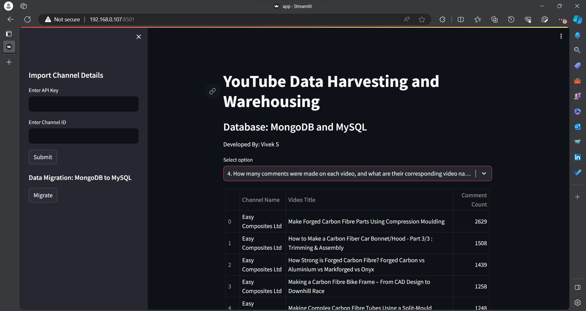 | **5. Highest likes per channel**<br>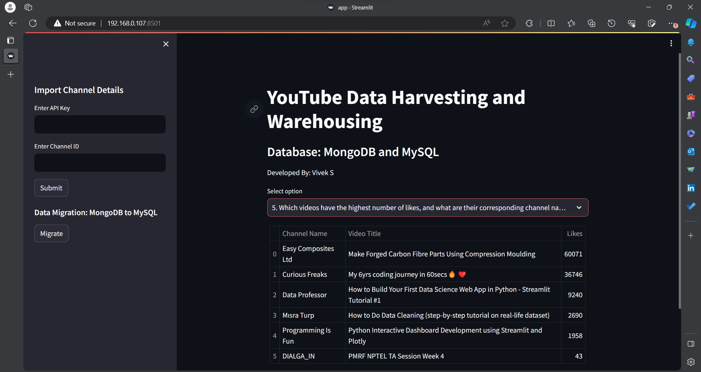 |
| **6. Likes per video**<br>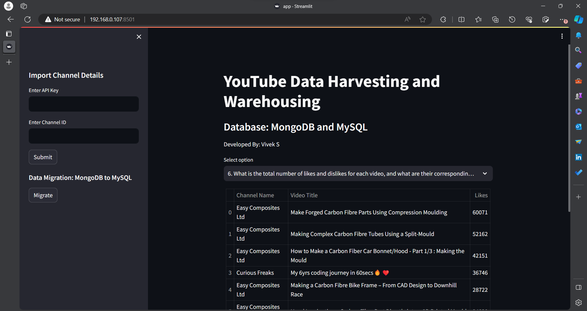 | **7. Total views per channel**<br>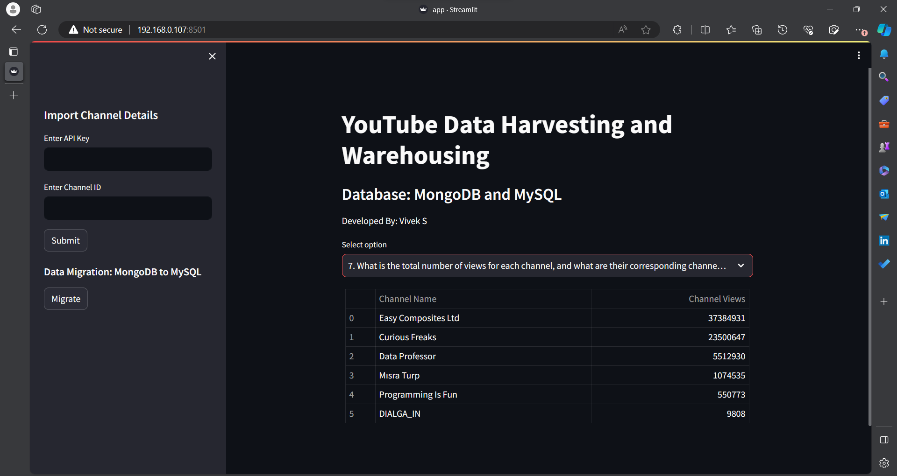 |
| **8. Channels published in 2022**<br>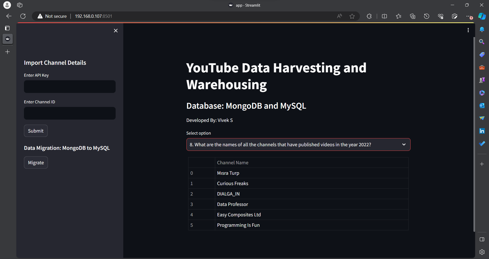 | **9. Average video duration per channel**<br>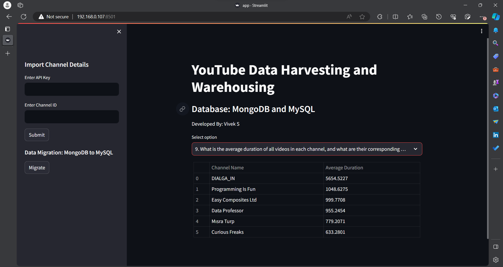 |
| **10. Most-commented videos**<br>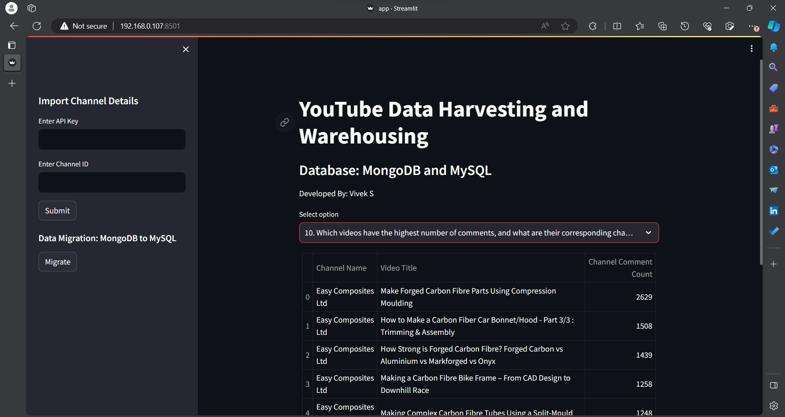 | |

---

## Security Notes

- No credentials are hardcoded in source — API keys are entered at runtime, and database credentials are loaded from `st.secrets`.
- `.streamlit/secrets.toml`, `api.txt`, and `channelid.txt` are excluded via `.gitignore` and should never be committed.
- If you're extending this project, consider adding connection pooling/reuse (the current MySQL connection is re-opened per query) and centralized error handling for API rate limits.

---

## Roadmap / Possible Improvements

- Parameterize the SQL queries instead of hardcoding channel-specific logic (e.g. the "year 2022" filter).
- Add retry/backoff handling for YouTube API quota limits.
- Reuse a single MySQL connection/cursor across queries instead of reconnecting each time.
- Add automated tests and a CI pipeline.

---

## License

This project is licensed under the [MIT License](LICENSE).
